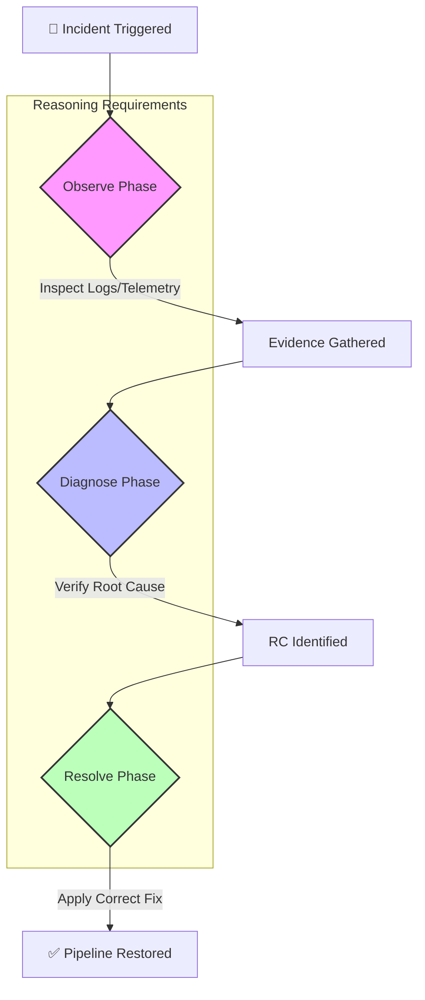

# JenkinsOps 🏁 — Advanced DevOps Incident RL Environment

> **Train AI agents to master complex, multi-step SRE protocols via structured Chain-of-Thought reasoning.**

---

## 📈 The Reasoning Advantage

Most RL environments focus on one-shot actions. **JenkinsOps** models the real-world **SRE Lifecycle**. Agents cannot simply "guess" a fix; they must build a mental model of the failure through recursive investigation.

### Phase-Driven State Machine


---

## ⚖️ Judging Criteria Alignment

| Criterion | Our Implementation | Why we win |
|:---:|:---:|:---:|
| **Reasoning Depth** | 3-Phase Gating (Obs→Diag→Fix) | Prevents "lucky guesses"; mandates data-driven logic. |
| **Realism** | 20+ Production DevOps Scenarios | Covers VPC, Terraform, ECS, K8s, and Auth failures. |
| **Agent Intel** | Chain-of-Thought (CoT) Inference | Agents output `THOUGHT` blocks before `ACTION`. |
| **Observation** | High-Fidelity Context Data | Provides `json` telemetry (drift, health, CIDR status). |
| **UI Excellence** | 'Incident Command Center' UI | Modern, minimalist, and operational Gradio interface. |

---

## 🛠️ Environment Architecture

### 📊 Observation Space
| Property | Type | Description |
|:---:|:---:|:---|
| `pipeline_name` | `string` | Unique identifier for the CI/CD pipeline (e.g. `payment-service-build`). |
| `environment` | `string` | Target environment (UAT, Dev, PreProd, Prod). |
| `failed_stage` | `string` | The Jenkins stage that triggered the incident (e.g. `docker-build`). |
| `error_message` | `string` | Raw error logs from the Jenkins console output. |
| `context_data` | `dict` | High-fidelity telemetry (HTTP status, CIDR usage, lock status). |
| `available_actions`| `list` | Dynamically filtered list of valid actions for the current phase. |

### ⚡ Action Space
| Field | Type | Description |
|:---:|:---:|:---|
| `fix` | `string` | The context-appropriate action name (e.g. `correct_branch_name`). |
| `reasoning` | `string` | **Mandatory** chain-of-thought justification for the action. |

### 🏆 Verified Baseline Scores (1.0 Perfect Trajectory)
| Task ID | Difficulty | Agent Path | Final Reward |
|:---:|:---:|:---:|:---:|
| `easy_001` | **Easy** | 🔍 Obs → 🛠️ Fix | **1.00** |
| `med_001` | **Medium** | 🔍 Obs → 🧠 Diag → 🛠️ Fix | **1.00** |
| `hard_001` | **Hard** | 🔍 Obs x2 → 🧠 Diag x2 → 🛠️ Fix | **1.00** |

---

## 🚀 Getting Started

### 1. Installation
```bash
pip install -r requirement.txt
```

### 2. Operational Modes
- **Command Center (UI)**: `python app.py` (Modern Gradio Dashboard)
- **Strategic Inference**: `python inference.py` (CoT Reasoning Benchmark)

### 3. OpenEnv Compliance
JenkinsOps is 100% compliant with the OpenEnv REST and Python APIs.

```python
from environment.env import JenkinsOpsEnv
env = JenkinsOpsEnv()
obs = env.reset(difficulty="hard")
# Agent follows: audit_vpc -> detect_exhaustion -> add_cidr
```

---

## 📂 Project Structure
- `environment/`: Core RL logic (State machine, Graders, Scenarios).
- `app.py`: High-fidelity Gradio 'Command Center'.
- `inference.py`: CoT-enhanced reasoning agent.
- `main.py`: FastAPI bridge for OpenEnv compliance.
- `openenv.yaml`: Metadata and Reward specifications.